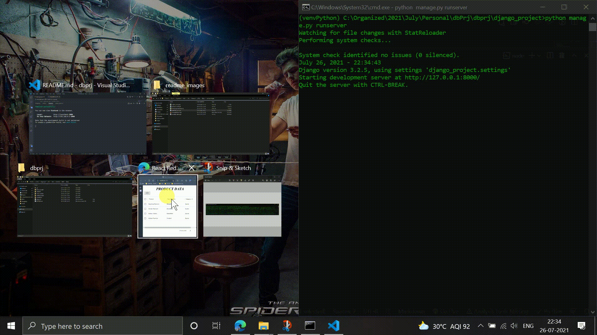
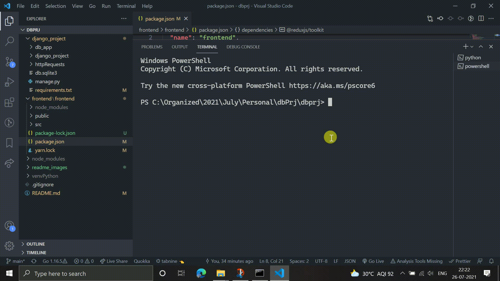

React Application integrated with Django REST framework for Create and Read operations.

# Table Of Contents

- [Table Of Contents](#table-of-contents)
- [Setup Instructions](#setup-instructions)
  - [Backend Configuration](#backend-configuration)
  - [Frontend Configuration](#frontend-configuration)
- [Architecture](#frontend-configuration)
  - [Frontend Architecture](#frontend-architecture)
  - [Backend Architecture](#backend-architecture)
- [Demo](#demo)
  - [Complete](#complete)
  - [Frontend](#frontend)
  - [Backend](#backend)
  - [Wait Process](#wait-process)

# Setup Instructions

- git clone `https://github.com/spidey1405/drm-mini-project`

# Backend Configuration

First cd into `drm-mini-project/django_project` and then setup the virtual environment by the following command:

`python -m venv venvPython`

If you're using linux:

`source venvPython/bin/activate`

If you're using Windows:

`venvPython\Scripts\activate`


after activating the virtual environment: (Note here, venvPython is excluded in .gitignore due to unnecessary file upload)

`pip install -r requirements.txt`


Note that apart from the packages mentioned in the problem statement, we would also need `django-cors-headers` to avoid cors blocking of backend.

Once everything is installed, we can start backend by the following command:

`python manage.py runserver`

To confirm the server is running, you would see the following output:

```
(venvPython) C:\Organized\2021\July\Personal\dbPrj\dbprj\django_project>python manage.py runserver
Watching for file changes with StatReloader
Performing system checks...

System check identified no issues (0 silenced).
July 26, 2021 - 21:58:23
Django version 3.2.5, using settings 'django_project.settings'
Starting development server at http://127.0.0.1:8000/
Quit the server with CTRL-BREAK.
```

This confirms that backend has been successfully configured and running.

# Frontend Configuration

Assumming that we're starting from the base folder we need to cd into frontend folder by following command:

`cd frontend/frontend/`

To install all the packages:

`npm install` (npm install is preffered to avoid any package related errors. Though we will be using `yarn` everywhere else.)

In case `node-sass` version (which is used here to compile `scss` files into `css`) shows up version issues, do this to avoid any conflicts:

_for yarn_
yarn remove node-sass
yarn add node-sass@4.14.1

_for npm_
npm uninstall node-sass
npm install node-sass@4.14.1

Once the installation is successfull, we need to start the frontend server using:

`yarn start` or `npm run start`

If everything goes fine we will see the end output as following:

```
Compiled successfully!

You can now view frontend in the browser.

  Local:            http://localhost:3000
  On Your Network:  http://192.168.0.5:3000

Note that the development build is not optimized.
To create a production build, use yarn build.
```

Everything is configured as expected. Now we can test and use our web application!
# Architecture

## Frontend Architecture

Frontend Architecture is solely built on React JS and Material UI. Additionally for smooth state management, Redux Toolkit has been used.

## Backend Architecture

Backend Architecture is completely based on Django Rest Framework.

# Demo

## Complete



## Frontend



## Backend


## Wait Process


